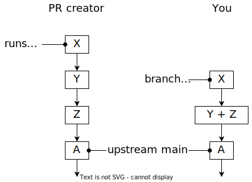

# Check Out Someone Else's PR

While reviewing someone else's pull request, it may be useful to pull their changes to your local repo, so you can run their code, or view it in your editor/IDE, etc.

To do so, get the number of the PR you want to pull, and run `spr patch <number>`. This creates a local branch named `PR-<number>`, and checks it out.

The head of this new local branch is the PR commit itself. The branch is based on the `main` commit that was closest to the PR commit in the creator's local repo. In between:

- If the PR commit was directly on top of a `main` commit, then the PR commit will be the only one on the branch.

- If there were commits between the PR commit and the nearest `main` commit, they will be squashed into a single commit in your new local branch.

Thus, the new local branch always has either one or two commits on it, before joining `main`.

## Updating the PR

You can amend the head commit of the `PR-<number>` branch locally, and run `spr diff` to update the PR; it doesn't matter that you didn't create the PR. However, doing so will overwrite the contents of the PR on GitHub with what you have locally. You should coordinate with the PR creator before doing so.
